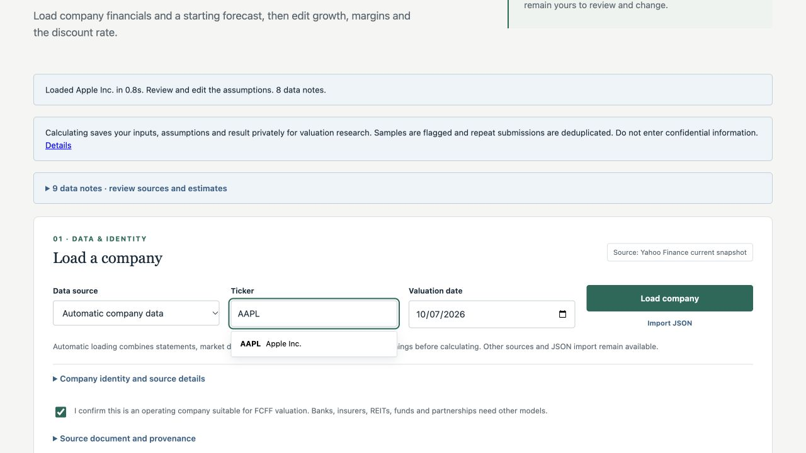

# CUIG Valuation Suite

A valuation suite with five-year unlevered discounted cash flow, dividend discount and trading-comparable models based on the **CUIG Valuation Template Fall 2026**. It shows intrinsic value today and a separate 12-month target scenario, with editable operating drivers, auditable financial sources and a replaceable data provider.

**Public demo:** https://dcf-valuation-engine.scswitzer.workers.dev



## Features

- Enter a ticker to load three annual periods, market price, diluted shares, capital claims and estimated capital costs. Review the source notes, then edit your forecast assumptions.
- DDM based on common-dividend forecasts, equity-return discounting and separate present/12-month values.
- Relative valuation with EV/Revenue, EV/EBITDA, EV/EBIT, P/E and P/B, peer means, selectable methods and financial-firm restrictions.
- DCF-to-method handoff reuses identity/forward forecasts while requiring sourced dividends and peers.

- Three historical fiscal years and five years of individually editable revenue growth, EBIT, net-income, book-value, D&A, CapEx, working-capital and tax assumptions.
- Present and 12-month enterprise-to-common-equity bridges, including preferred claims, noncontrolling interests, other nonoperating assets and diluted shares.
- CUIG Gordon-growth terminal convention, plus optional ROIC-based terminal reinvestment normalization.
- WACC/terminal-growth sensitivity and explicitly defined bear/base/bull cases.
- Offline synthetic example, manual entry, JSON import, SEC companyfacts adapter, and an optional Zion/MiniBloomberg company-packet adapter.
- CSV export for Excel and complete JSON export containing inputs, assumptions, results and source provenance.
- Local ticker autocomplete, accessible input labels, mobile layouts and preserved inputs on errors.
- Pure Python calculation engine, Flask API, public Cloudflare Python Worker, private D1 valuation records, shared edge rate limits, regression tests and GitHub Actions.

## Run locally

Python 3.12 or 3.13 and Node.js (only for JavaScript syntax validation in development).

```bash
git clone https://github.com/Scott-Switzer/DCF-stock-valuation-Engine.git
cd DCF-stock-valuation-Engine
python3 -m venv .venv
source .venv/bin/activate
pip install -r requirements-dev.txt
python app.py
```

Open <http://127.0.0.1:5000>. The initial form starts with ticker loading. Choose **Offline example** to run without keys or internet. On the form, **5 means 5%**. Financial amounts and diluted shares use **absolute units**, not millions. JSON and CLI rates use decimals: `0.05` means 5%.

```bash
python run_dcf.py
python run_dcf.py --financials data/demo.json --wacc 0.065 --growth 0.05 0.05 0.05 0.05 0.05
pytest -q
ruff check .
node --check static/js/app.js
```

The old FMP/Yahoo/edgartools loader and console scraping have been replaced. No FMP key or Yahoo access is required for sample/manual mode. Local hosting uses Flask, requests and Gunicorn. Cloudflare hosting uses the Python Workers runtime and WSGI adapter; provider requests use bounded Workers fetch.

## Data providers

**Automatic / Yahoo:** No key required. Current USD equity snapshots populate financials and compute weekly-return beta, Treasury yield, CAPM cost of equity, debt cost and WACC. Annual common dividends populate DDM; a starter peer set populates RV. Default equity risk premium (5%), credit spread (1.5%) and forecast growth (5%) are visible assumptions. ROE is an inspectable accounting ratio, not a required return. Yahoo endpoints are unofficial and can change or rate-limit; data coverage is not guaranteed. Automatic historical point-in-time loading is rejected. Missing critical observations produce actionable errors rather than invented zeros.

**Manual / sample:** Enter financials from your own annual reports. Missing input is rejected; zero is accepted only as an explicit numerical input. Import a `dcf-financials-v1` JSON document using the form. Downloads can be re-used as inputs by importing the `financials` object from a complete valuation export.

**SEC:** Set `EDGAR_IDENTITY` to your name and contact email in your shell or deployment environment. The app calls SEC's documented companyfacts API directly, selects annual USD facts available by the valuation date, and preserves tag/accession/filing provenance. No SEC key is required. Confirm company eligibility, enter a dated market price, and review diluted shares. Missing taxonomy fields remain blank for manual completion. SEC annual weighted-average diluted shares may need adjustments for current dilution. Debt classification, leases and D&A coverage require filing review.

**Custom company API (Zion-compatible):** Optional private server-side `ZION_API_BASE_URL` and `ZION_API_TOKEN`. This is a custom private API, not a public Zion product. The adapter reads `/v1/company/{ticker}` with an explicit point-in-time cutoff, maps annual metric observations, preserves release/observation provenance, and uses a dated price when present. Neither the endpoint nor credentials are embedded in frontend code. Configuration and a live integration acceptance check are required before claiming a connected deployment. Partial coverage remains incomplete rather than becoming zeros.

**Custom normalized API:** Optional server-side `DCF_API_BASE_URL` and `DCF_API_TOKEN`, exposing `/v1/valuation/financials/{ticker}`. See [the provider contract](docs/provider-contract.md) and [JSON schema](docs/financials.schema.json). This makes future provider changes independent of the model.

Environment variables are read directly. `.env.example` documents names, but the app does not automatically load a populated `.env` file. Do not commit keys or licensed datasets.

## Methodology and limits

Read [DCF alignment](docs/cuig-alignment.md) and [DDM/relative alignment](docs/ddm-relative-alignment.md) for exact worksheet references, formula reconciliation and intentional differences.

- End-of-year cash-flow discounting. Forecast periods start one year from the valuation date; fiscal-year stubs are not modeled.
- Automatic WACC combines sourced market/financial inputs with explicit premium/spread assumptions and remains editable, as required by CUIG. Latest missing interest expense uses Treasury yield plus credit spread; older expense is not silently carried forward.
- Template terminal FCFF is year-five FCFF × (1 + g). Normalized mode uses terminal NOPAT × (1 − g / terminal ROIC). Terminal FCFF must be positive; terminal growth must be below WACC.
- 12-month target excludes year-one FCFF and discounts remaining flows one fewer year. Current debt/cash/claims/shares carry forward unless overridden. This is an assumption-dependent valuation scenario, not a stock-price forecast.
- Loss-period tax benefits follow the CUIG formula. Assess actual tax-loss utilization. Negative common equity is exposed; per-share value is floored at zero.
- USD operating companies only. Banks, insurers, REITs, funds and partnerships need other models. Automatic loading checks SEC SIC classification when available; unavailable classification needs user review. Starter peers also need review.
- The sample, cases and tests establish formula behavior. They do not establish investment returns or accurate forecasts for all companies. No automatic financial recommendation is made.

## Company workspace

Enter a ticker once and switch DCF, dividend discount and relative valuation while preserving each method’s assumptions. Results update after a 350 ms input debounce; saving is a separate action. Historical/analyst growth references are compact and consensus applies only to matching future fiscal periods. Rates display two decimals while retaining provider precision until edited. The result compares market price, current intrinsic value where defined, 12-month model target and analyst consensus. SVG projections, a bridge view and sensitivity support inspection. Mobile charts are collapsed initially.

Four distinct RV candidates are always supplied, including imperfect or unverified fallback fits with caveats. Missing snapshots remain visible and excluded; replacement fetches actual data, and selection or manual overrides on other peers persist. RV initially carries the current valid DCF year-one forecast, then remains independently editable. Company data is reused across methods; peers load only when RV is opened. SEC research loads only when its disclosure opens. Recent earnings-release outlook excerpts are optional, dated and linked; ambiguous guidance is not turned into an annual forecast. Existing CSV/JSON exports use the exact preview inputs. No Excel-template export is provided.

`POST /api/preview/{dcf|ddm|relative}` accepts the same JSON/form payloads as calculation APIs but never saves. `POST /api/assemble/{method}` reuses a validated DCF financial document and optional DCF assumptions. `POST /api/peer` loads one replacement ticker. `GET /api/guidance/{ticker}` returns issuer-bound dated SEC filing links and optional outlook prose. Preview requests have a separate 120/minute client budget; analyst/guidance references share 20/minute, other expensive operations retain 10/minute.

The workspace keeps the existing audited forms in same-origin editors, isolating their field names and allowing independent model state. Only embedded editors permit same-origin framing; other pages retain framing protection. Message handlers validate both origin and the expected window. Generation guards discard old company and preview responses. Invalid previews disable saving/exporting and clearly mark the last valid result.

## API and exports

`POST /api/load/{dcf|ddm|relative}` loads a ticker and returns `{financials, form, warnings, load_summary}` without saving a valuation. `POST /api/compare/batch` values up to 8 tickers per call. LLM assistants use `POST /mcp` (see `GET /.well-known/mcp.json`); the full guide is [docs/workflow.md](docs/workflow.md). Provider status is at `/providers` and `GET /api/providers`.

`GET /api/sample`, `GET /api/search?q=AAPL`, `POST /api/financials`, `POST /api/calculate`, `POST /export/csv`, `POST /export/json`. Invalid input returns HTTP 400, provider failure HTTP 503, and rate limits HTTP 429. See [API examples](docs/provider-contract.md).

Exports retain full numeric precision; the UI rounds money for readability. They include the active assumptions and warnings. CSV opens in Excel; it is not a formula-driven `.xlsx` replica of the supplied workbook.

## Deploy

[Cloudflare deployment guide](docs/deployment.md). The public Worker supports ticker-first DCF/DDM/RV, sample/manual calculations, SEC statement loading and private D1 persistence. PPE financial snapshots are available through the R2-backed company API; the separate Zion HTTP adapter remains unconfigured. Docker and `render.yaml` are alternative hosting recipes.

```bash
gunicorn --bind 0.0.0.0:5000 --workers 2 --threads 2 --timeout 35 app:app
```

The company workspace calculates live previews without storing them. Explicit Save valuation actions and legacy calculation endpoints save inputs, assumptions, model version and results to private D1 storage. A privacy link explains collection. Synthetic origins are flagged and repeat submissions are deduplicated. Raw IP addresses are not stored in valuation records. See [research limitations](docs/valuation-research.md). The historical suspended Render service has been replaced as the advertised demo.

## Future valuation suite

The normalized company document, pure calculation engine and structured API outputs are the foundation for additional methods. DCF, DDM and trading comparables are implemented. A combined football-field view and additional sector-specific methods remain future work. They will need their own assumptions, suitability checks and reconciliation tests rather than reusing FCFF for every sector.

MIT licensed. The CUIG workbook is a user-supplied reference and is not redistributed or modified. Public provider data remains subject to each provider's terms and access policies.

### PPE snapshot autofill

Ticker loading prefers compatible public SEC financials from PPE compact packets. AAPL has three years of SEC-backed operating inputs, capex, D&A, operating working capital, effective tax rates and diluted weighted-average shares. Current prices, beta/risk-free inputs and unverified common-income/common-dividend/common-equity fields retain explicitly labeled Yahoo fallbacks. The same overlay applies to RV peers. Inspect Advanced → PPE & fallback coverage for dates and sources.

The server endpoint `/api/company/AAPL` serves only a bounded public SEC valuation packet. It does not expose warehouse price objects or credentials. [Packet contract and publication](docs/ppe-packets.md) describes cutoff selection, coverage, caching and refresh.
